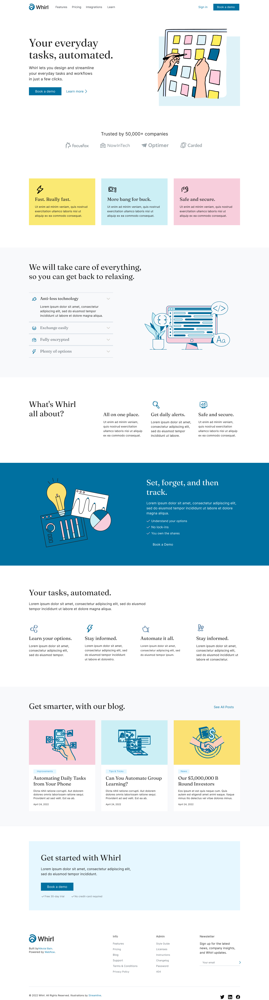

# Whirl landing page
#HTML&nbsp; &nbsp;#SCSS&nbsp; &nbsp;#JavaScript&nbsp; &nbsp;#landing-page

## Made with 🛠️

## Github Page 💻

<a href="https://Oleksandr073.github.io/Whirl-landing-page/" target="_blank">https://Oleksandr073.github.io/Whirl-landing-page/</a>

## Template 👇

<a href="https://www.figma.com/file/KXzj5MFY1DL7CFUfVHteN1/Whirl" target="_blank">https://www.figma.com/file/KXzj5MFY1DL7CFUfVHteN1/Whirl</a>

